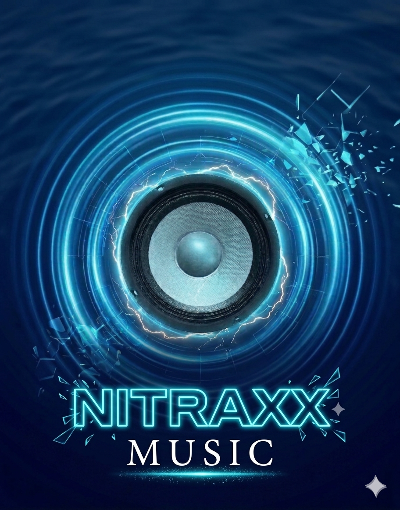
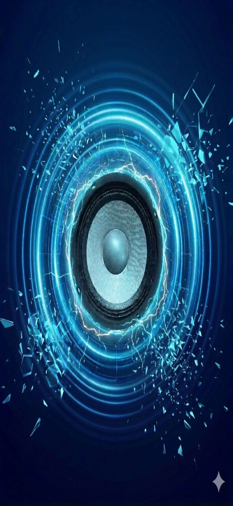

# 🎵 Nitraxx Music

  

**Nitraxx Music** es una aplicación de música premium desarrollada con React Native y Expo. Está diseñada para ofrecer una experiencia visual impactante con efectos de neón y animaciones de "retumbo" dinámico que reaccionan al sonido.

## ✨ Características principales
* **Efecto Retumbo:** La interfaz y el logo vibran simulando la potencia de un parlante real.
* **Interfaz Estilo Harmony:** Diseño optimizado en azul oscuro profundo con detalles en cian neón.
* **Multi-Plataforma:** Interfaz adaptable para un funcionamiento fluido tanto en celulares como en tablets.
* **Buscador Inteligente:** Conexión conceptual para unificar librerías de música globales.

## 🚀 Vista Previa del Splash
Al iniciar la aplicación, se despliega una animación de onda de expansión sobre el fondo oscuro, centrada en nuestro icónico parlante cian.

  

## 🛠️ Tecnologías utilizadas
* **React Native & Expo:** Para el núcleo de la aplicación.
* **Expo AV:** Para la gestión de reproducción de audio.
* **Animated API:** Para lograr el efecto de vibración y retumbo en el logo.

## 🔧 Instalación
1. Clona este repositorio de GitHub.
2. Instala las dependencias con `npm install` o `yarn install`.
3. Ejecuta `npx expo start` para probarla en tu dispositivo.

---
*Desarrollado con pasión tecnológica por Nitraxx07*
